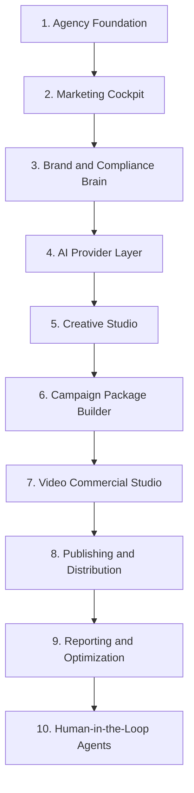

# GetGoGone Agency Command Center Roadmap

GetGoGone is now being built as a personal, multi-client dealership marketing command center. The primary operator is the agency owner, not the dealership sales team. Salespeople may receive leads, tasks, and follow-up prompts later, but the platform is designed around one person running serious marketing operations across multiple small dealerships.

Core promise:

> One operator can plan, generate, edit, approve, publish, track, and improve dealership marketing across multiple clients from one controlled workspace.

## Operating Principles

- Agency-first: the owner/operator controls campaigns, creative, publishing, reporting, and AI workflows.
- Multi-client by default: every vehicle, campaign, lead, template, asset, task, publishing log, and generated output must be scoped to a client/dealership.
- Toolbox, not toy: AI copy, Spanish adaptation, Figma-style editing, image tools, video generation, publishing helpers, and reporting should feel like one connected production system.
- Human approval first: automation agents propose and stage work before anything customer-facing is sent or published.
- Free/local-first AI: Ollama is the active provider for the current build. Future cloud tools such as cheaper frontier models, Google Omni, image tools, and voice tools must connect through adapters instead of being hardcoded into product screens.
- Manual publishing matters: some channels will have APIs, but Craigslist, Facebook groups, and other platforms may require assisted copy/download/checklist workflows.
- Compliance is infrastructure: down payment claims, finance/payment language, Spanish copy, and platform-specific rules must be generated through client-specific guardrails.

## Build Order



This order is intentional. Multi-client ownership and operating queues must come before advanced AI/video features, otherwise generated assets will be difficult to organize, approve, and measure.

## Phase 1: Agency Foundation

Goal:
Create the multi-client operating core. The app should always know whether the operator is viewing the agency overview or a specific dealership.

Decision:
A client equals one dealership for now. If one owner has multiple dealerships later, add an owner/group layer above dealership records while keeping vehicles, campaigns, leads, assets, and generated outputs scoped to `dealership_id`.

Build now:
- Client switcher in the sidebar.
- Active client context in the app shell.
- Agency overview route.
- Client-scoped reads for inventory, campaigns, creatives, and future leads.
- Clear visual indicator showing the active client.
- Server API patterns that accept and enforce `clientId` during this admin/prototype stage.

Production hardening later:
- Auth-backed agency roles.
- Client access policies.
- RLS policies tied to agency membership.
- Encrypted secret storage.

Data model candidates:
- Continue using `dealerships` as the client/root account table.
- Add optional client metadata to `dealerships`: status, billing contact, budget, source system, primary market.
- Add `agency_profiles` only when real multi-user agency access is needed.

API candidates:
- `GET /api/agency/clients`
- `POST /api/agency/clients`
- `GET /api/agency/overview`

Screens:
- Agency Dashboard
- Client Switcher
- Client Settings

## Phase 2: Marketing Cockpit

Goal:
Create the morning command center that tells the operator what needs action today.

Build now:
- Cross-client task/alert dashboard.
- Vehicles needing first campaign.
- Vehicles missing Spanish copy.
- Vehicles with stale campaigns.
- Vehicles with weak or missing creative.
- Campaign drafts pending review.
- Publishing packages pending manual action.

Likely data model:
- `marketing_queue_items`
  - `id`
  - `dealership_id`
  - `item_type`
  - `priority`
  - `target_type`
  - `target_id`
  - `reason`
  - `status`
  - `due_at`
  - `metadata`

API candidates:
- `GET /api/agency/cockpit`
- `POST /api/agency/queue/rebuild`
- `PATCH /api/agency/queue/:id`

Screens:
- Marketing Cockpit
- Queue detail drawer
- Quick action launchers into Campaign Builder, Designer, or Publishing helper

Important:
This is not just a dashboard. It becomes the operator's daily worklist.

## Phase 3: Brand And Compliance Brain

Goal:
Give each client a persistent marketing memory that every generator, template, and review tool uses.

Build now:
- Client brand profile.
- English tone.
- Spanish tone.
- Approved phrases.
- Banned phrases.
- Down payment rules.
- Finance/payment disclaimer rules.
- Preferred calls to action.
- Target customer notes.
- Platform-specific content rules.

Data model candidates:
- `client_brand_profiles`
- `client_compliance_rules`
- `client_channel_settings`

API candidates:
- `GET /api/agency/brand-brain?clientId=...`
- `PUT /api/agency/brand-brain`
- `POST /api/agency/compliance/check`

Screens:
- Brand Brain Settings
- Compliance Rules
- Channel Rules

Important:
This phase should come before major AI generation. Otherwise, AI output will be generic and risky.

## Phase 4: AI Provider Layer

Goal:
Build one internal AI interface that runs Ollama first and can later route tasks to cloud providers only when explicitly enabled.

Supported capability families:
- Text generation
- Spanish adaptation
- Compliance review
- Translation review
- Image generation
- Background removal
- Image cleanup
- Layout suggestion
- Video script generation
- Storyboard generation
- Video generation
- Voiceover
- Captions
- Performance analysis

Current provider decision:
- Ollama only for copy, Spanish adaptation, compliance review, rewrite repair, strategy drafts, and story/script generation.
- Deterministic server checks should run before local LLM checks where possible.
- Avoid unnecessary model swapping during one workflow because local VRAM is limited.
- If Ollama is unavailable, fail gracefully into manual/HITL flow instead of spending cloud credits automatically.

Future provider candidates:
- Cheaper frontier models for explicit opt-in high-quality reasoning or copy.
- Google Omni for video generation.
- Image tools for background removal, cleanup, and generation.
- Voice tools for future voiceover workflows.

Build now:
- `src/lib/ai/ai-provider.ts`
- Provider status checks.
- Task-based routing.
- Timeout handling.
- Local/offline status UI.
- Provider settings screen.
- Save every generated result to the database.

Environment candidates:

```env
LLM_PROVIDER=local
LOCAL_OLLAMA_URL=http://localhost:11434
LOCAL_TEXT_MODEL=llama3.1:8b
AI_FALLBACK_PROVIDER=none
AI_TIMEOUT_MS=20000
BG_REMOVER=local
VIDEO_PROVIDER=google_omni
```

Data model candidates:
- `ai_provider_settings`
- `generated_outputs`

API candidates:
- `GET /api/ai/status`
- `POST /api/ai/generate`
- `GET /api/ai/generated-outputs`
- `PATCH /api/ai/generated-outputs`
- `POST /api/ai/compliance-check`
- `POST /api/ai/translate-adapt`

Important:
Provider settings should not expose raw API keys in normal database rows. Use environment variables first, then encrypted secret references later.

## Phase 5: Creative Studio

Goal:
Turn Designer into a real dealership creative production tool with editable layers, saved projects, reusable templates, and channel-specific exports.

Build now:
- Vehicle-first project creation.
- Layer-based canvas.
- Undo/redo.
- Fully editable and deletable layers.
- Saved templates.
- Saved creative versions.
- Client-scoped brand kits.
- Channel size presets.
- Text blocks.
- Badges and approved uploaded partner logos.
- Background removal hook.
- Export/render pipeline planning.

Expand next:
- Figma-like layer panel.
- Shape tools.
- Alignment tools.
- Lock/hide/reorder layers.
- Font controls.
- Smart templates.
- Collage builder.
- Import GetGoGone JSON templates.
- Import SVG/PNG/JPG/PDF as editable or locked assets where possible.
- Asset rights/licensing metadata.

Data model candidates:
- Continue using `creative_templates` for reusable templates.
- Add `creative_projects` for active editable projects.
- Add `creative_versions` for saved versions/snapshots.
- Use Supabase Storage for rendered files.

API candidates:
- `POST /api/designer/projects`
- `GET /api/designer/projects?clientId=...`
- `POST /api/designer/render`
- `POST /api/designer/import`
- `POST /api/ai/remove-background`

Important:
The vehicle photo remains the base layer. "Blank canvas" means blank overlay on top of the vehicle photo, not an empty graphic with no vehicle.

## Phase 6: Campaign Package Builder

Goal:
Generate full channel-specific marketing packages for a selected vehicle or group of vehicles.

Build now:
- Package generator per vehicle.
- English and Spanish copy.
- Platform-specific outputs.
- Saved generated outputs.
- Review and edit screen.
- Campaign asset handoff into Designer.

Channel outputs:
- Meta paid ads.
- Facebook organic/manual helper copy.
- Instagram feed/story/reel copy.
- Google Business Profile post.
- Google Ads headlines/descriptions.
- Craigslist title/body/helper fields.
- LinkedIn commercial vehicle posts.
- SMS follow-up.
- Email blast.
- Print/flyer copy.
- Website/landing page copy.
- Video script seed.

Data model candidates:
- Existing `campaigns`
- Existing `campaign_channels`
- `generated_outputs`
- `campaign_packages`

API candidates:
- `POST /api/campaigns/package-generate`
- `GET /api/campaigns/package-review?campaignId=...`
- `PATCH /api/campaigns/generated-output/:id`

Important:
Do not force one generic ad into every platform. Each channel has its own required fields, tone, format, and publishing path.

## Phase 7: Video Commercial Studio

Goal:
Build a production workflow for dealership video ads, not just a random "generate video" button. Script, storyboard, shot list, captions, and voiceover planning come before Google Omni generation.

Workflow:
1. Select client and vehicle.
2. Choose video goal.
3. Generate strategy.
4. Generate script.
5. Generate storyboard.
6. Generate shot prompts.
7. Generate or upload voiceover.
8. Generate captions.
9. Send approved scenes to Google Omni when the provider adapter is enabled.
10. Review scene clips.
11. Compile final video.
12. Save and publish/export.

Video types:
- Vehicle walkaround.
- Down payment promo.
- Spanish promo.
- Work truck/commercial vehicle ad.
- Family SUV ad.
- Lot-wide sale.
- Fresh arrival.
- Price drop.

Data model candidates:
- `video_projects`
- `storyboards`
- `video_scenes`
- `video_assets`

API candidates:
- `POST /api/video/script`
- `POST /api/video/storyboard`
- `POST /api/video/scenes/generate`
- `POST /api/video/voiceover`
- `POST /api/video/captions`
- `POST /api/video/compile`

Provider notes:
Google Omni access should be implemented through a provider adapter because model names, availability, quota, and platform access can change. The product should support the available Google API path without reshaping the internal video workflow around one SDK.

## Phase 8: Publishing And Distribution

Goal:
Move assets from "ready" to "live" through direct integrations where available and assisted manual workflows where not.

Build now:
- Publishing checklist per channel.
- Copy/download helper drawer.
- Publishing status log.
- Content calendar.
- Manual publish instructions.

Priority channels:
- Google Business Profile.
- Google Ads.
- Meta paid ads.
- Instagram.
- Craigslist.
- Cars.com assisted package.
- AutoTrader assisted package.
- YouTube/TikTok short-form assets.
- Facebook personal/group posting later, because CarsForSale/MyCommandCenter already covers the lot's current free posting workflow.

Later:
- Meta paid ads API.
- Google Business Profile integration.
- Google Ads integration.
- LinkedIn posting where available.
- Platform metrics sync.

Data model candidates:
- `publishing_tasks`
- `publishing_log`
- `manual_publish_checklists`
- `content_calendar_items`

API candidates:
- `POST /api/publishing/tasks`
- `PATCH /api/publishing/tasks/:id`
- `POST /api/publishing/log`
- `GET /api/publishing/calendar?clientId=...`

Important:
Manual workflows are not second-class. If an API is unavailable or risky, the app should still package the exact copy, image, fields, and checklist needed to publish cleanly.

## Phase 9: Reporting And Optimization

Goal:
Prove value to clients and teach the system what works.

Build now:
- Campaign activity history.
- Publishing history.
- Lead/source attribution where available.
- Manual metric entry when APIs are not connected.
- Client-level reporting.
- Vehicle-level campaign performance.

Later:
- Platform API metric sync.
- Cost per lead.
- Lead-to-sale attribution.
- AI performance recommendations.
- Monthly client report exports.

Data model candidates:
- `campaign_metrics`
- `manual_metric_entries`
- `client_reports`
- `optimization_recommendations`

API candidates:
- `GET /api/agency/analytics`
- `POST /api/agency/metrics/manual`
- `POST /api/agency/optimize`
- `POST /api/reports/monthly`

Important:
Until platform APIs are connected, reporting should support full manual metric entry and publishing logs. Do not block reporting on perfect integrations. Manual entry is acceptable while inventory feeds, CarsForSale API access, ad platform APIs, and marketplace integrations are still being negotiated or built.

## Phase 10: Human-In-The-Loop Agents

Goal:
Turn repeated operating work into staged agent proposals that the agency owner reviews and approves.

Agent candidates:
- Inventory Watcher
- Campaign Planner
- Spanish Copywriter
- Creative Refresher
- Video Producer
- Publishing Assistant
- Lead Follow-up Assistant
- Reporting Analyst
- Compliance Checker

Build now:
- Agent settings.
- Agent proposal queue.
- Approve/reject actions.
- Clear audit trail.

Data model candidates:
- `agent_settings`
- `staged_activities`
- `agent_runs`

`staged_activities` should include both `target_type` and `target_id`, not a generic `target_id` alone.

API candidates:
- `GET /api/agents/status`
- `POST /api/agents/run`
- `GET /api/agents/proposals`
- `POST /api/agents/proposals/:id/approve`
- `POST /api/agents/proposals/:id/reject`

Important:
Agents should not publish, text, email, spend ad budget, or alter client-facing assets without approval until the workflow is proven and explicitly enabled.

## Immediate Implementation Sequence

Primary sequencing reference:

- `docs/AGENTIC_IMPLEMENTATION_STRATEGY.md` defines the session-by-session build order, flow logic, screen purpose map, and agent-friendly architecture rules. Use it before starting new feature work so new sessions do not create redundant or throwaway surfaces.

Start here:

- [x] Add active client context and client switcher.
- [x] Add agency overview shell.
- [x] Make Inventory API client-aware.
- [x] Make Campaign API client-aware.
- [x] Make Creative Template API client-aware.
- [x] Add client-scoped Creatives and Designer save/load behavior.
- [x] Add Marketing Cockpit queue model and screen.
- [x] Add Brand Brain screen and persistence.
- [x] Add AI status endpoint for local/cloud provider health.
- [x] Add first AI generate-copy endpoint using Brand Brain rules.
- [x] Add generated-output persistence and AI Library review screen.
- [x] Add editable AI output review, compliance flags, reviewed status, and approve/archive flow.
- [x] Add compliance-check API with deterministic rules plus local AI review, and persist review results on generated outputs.
- [x] Add Package Builder screen that generates multi-channel copy, runs compliance checks, saves AI outputs, and creates a draft campaign package using existing campaign tables.
- [x] Add bounded rewrite-to-pass-compliance loop with three attempts and HITL escalation for unresolved generated outputs.
- [x] Add HITL queue routing and saved rewrite attempt history so failed generations can be reviewed without losing the agent trail.
- [x] Add AI Library phrase highlighting, rejection notes, send-back-to-rewrite control, and generated output event audit logging.
- [x] Upgrade Campaign Review with channel status counts, readiness checklist, approve/export/published actions, and manual publish URL tracking.
- [x] Formalize channel modules with priority-specific GBP, Google Ads, Meta, Instagram, Craigslist, Cars.com, AutoTrader, and video package contracts.
- [x] Add shared inventory readiness scoring and surface it in Inventory and Marketing Cockpit.
- [x] Surface readiness blockers, opportunities, and channel fit hints inside Package Builder.
- [x] Expose vehicle readiness scoring through `/api/inventory/readiness` for agent-friendly workflows.
- [x] Add campaign channel recommendation logic and expose it through `/api/campaigns/recommendations`.
- [x] Wire Cockpit campaign queue actions into Package Builder with recommended channels preselected.
- [x] Collapse old Campaign Builder route into Package Builder as the primary campaign creation path.
- [x] Add first-pass Cockpit agent proposal queue with approve/reject controls.

Do not start with:
- Fully autonomous agents.
- Full local image generation.
- Raw API publishing to ad platforms.
- Complex video compilation.

Those belong after the operating model, client scope, saved outputs, and review flows are stable.

## Schema Decision Rules

- Roadmap tables are candidates, not automatic migrations.
- Before each phase, create a focused migration plan.
- Prefer extending existing GetGoGone-owned tables when the concept is already represented.
- Add dedicated tables when the concept needs independent lifecycle, permissions, reporting, or versioning.
- Every new multi-client table must include `dealership_id` unless it is explicitly global.
- Generic references must use both `target_type` and `target_id`.
- Generated AI output must be saved with provider, prompt metadata, source object, language, and approval status.

## Locked Decisions

- A client equals one dealership for now.
- Multiple dealerships under one owner can be handled later with an owner/group layer above dealership records.
- Ollama is the active AI provider for the current build.
- Cloud fallback is not automatic right now; future cloud usage must be explicit and operator-controlled.
- Storyboard/script generation comes before Google Omni video generation.
- Publishing priority is Google Business Profile, Google Ads, Meta paid ads, Instagram, Craigslist, Cars.com assisted packages, AutoTrader assisted packages, and short-form video channels.
- Facebook personal/group posting remains lower priority because CarsForSale/MyCommandCenter already handles the lot's current free-posting workflow.
- Manual inventory, photo, publishing, and metric entry are acceptable during the early agency build.
- Long-term direction is seamless integration where API access is available, permissioned, stable, and worth the added complexity.
