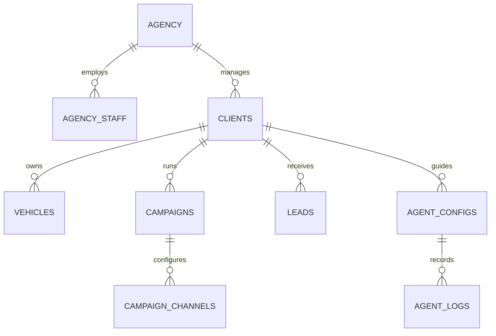
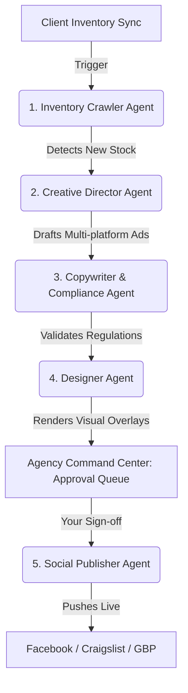
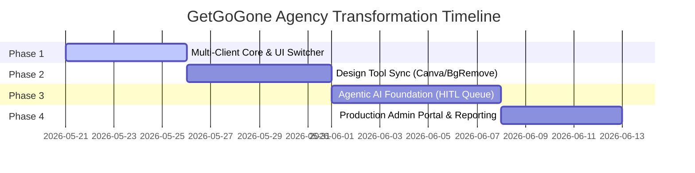

# GetGoGone: Agency-First Multi-Client AI Marketing Platform
## Proposal & Implementation Strategy

This proposal outlines the transformation of GetGoGone from a customer-based single-dealership SaaS into a **private AI Marketing Agency Platform**. 

In this model, **you (the Agency Owner)** perform all the creative construction, designing, channel coordination, and lead management across **multiple client accounts (dealerships)**. The platform acts as your high-leverage Command Center, amplified by **embedded external design integrations** and a specialized team of **Agentic AI Workers** operating under your supervision.

---

## 1. Conceptual Shift: SaaS to Agency Hub

| Dimension | Customer-Facing SaaS (Current) | AI Marketing Agency Hub (Proposed) |
| :--- | :--- | :--- |
| **Primary User** | Individual lot owner/salesperson (e.g., Ray Lawson at Wabash Auto) | Agency Owner (You) + your internal creative staff |
| **Workspace Mode** | Single-tenant (hardcoded or locked to one active lot) | **Multi-tenant Control Room** (easily switch client profiles) |
| **Campaign Operations** | Dealer manually drafts and reviews ads for their lot | AI drafts campaigns in bulk; **You review, refine, and sign off** |
| **Design Canvas** | Standard blank overlay on vehicle photo templates | **AI-enhanced visual composer** + native Canvas/Figma API sync |
| **Lead Handling** | Lot salespeople reply to notifications in a basic inbox | **Lead Liaison Agents** draft multi-lingual replies and stage bookings for your review |

---

## 2. Multi-Tenant Database & Core Architecture

Fortunately, the current database design is **already structurally multi-tenant**! Almost all tables (`vehicles`, `campaigns`, `leads`, `creative_templates`, `workflows`) have a `dealership_id` foreign key. 

To turn this into a premium agency hub, we only need a few additions to represent the agency itself, client relationships, and agent behaviors:

### Proposed Schema Extensions (`supabase/migrations/`)
To support the agency layout, we would introduce a new migration containing:
1. **`agency_profiles`**: Tracks agency staff and permissions.
2. **`clients`**: We can rename or alias `dealerships` to `clients` (or expand the columns of `dealerships` to store client-specific subscription tiers, agency fees, and contact notes).
3. **`agent_configs`**: Stores client-specific guidance, target audience profiles, tone instructions, and dynamic memory parameters for each AI Agent.
4. **`agent_logs`**: Tracks autonomous activities, completed tasks, generated text/designs, and items awaiting agency approval.
5. **`design_tool_connections`**: Stores developer tokens and sync configurations for Figma, Canva, or stable diffusion backends.

---

## 3. The Agentic AI Command Center

A dedicated **Agentic AI** section will let you delegate operations to virtual specialists. These agents do not run completely blind; they follow a **Human-in-the-Loop (HITL)** architecture. They generate, staging items in your dashboard, and await your single-click approval.

### Five Core Specialists to Introduce:

#### 🤖 1. The Inventory Crawler Agent (The Scout)
*   **Job**: Automatically monitors inventory channels (syncs inspections, Carsforsale APIs, or uploaded CSVs) for each client.
*   **Action**: Flags fresh arrivals, automatically tags "aging vehicles" (30+ days on lot), identifies missing assets (e.g., poor photo quality, missing price), and schedules campaign drafting tasks.

#### 🤖 2. The Creative Director Agent (The Planner)
*   **Job**: Determines the optimal marketing strategy for a vehicle based on its specs, condition, and seasonal trends.
*   **Action**: Decides whether a car needs a "Down Payment Special," a "Spanish-First Outreach," or an "Aging Inventory Push," planning the campaign package across Meta, Craigslist, GBP, and SMS.

#### 🤖 3. The Copywriter & Compliance Guardian (The Editor)
*   **Job**: Generates high-converting, compliant, multi-lingual copies.
*   **Action**: Drafts ads in English and Spanish. Automatically injects regulatory checks (ensuring down payments are clear, avoiding misleading "$0 Down" claims, and appending required credit disclaimers).

#### 🤖 4. The Designer Agent (The Visualizer)
*   **Job**: Combines vehicle source photos with overlay designs dynamically.
*   **Action**: Communicates with the Designer API. Reads vehicle features (e.g., "Third Row Seats", "4x4") and places matching overlays, stickers, and headers onto base photos using the client's custom brand colors.

#### 🤖 5. The Lead Liaison & Responder (The Coordinator)
*   **Job**: Monitored incoming leads across clients.
*   **Action**: Drafts contextual multi-lingual responses to incoming questions (e.g. "Is the Altima still available?"). Stages draft replies or schedules test drives for you to click "Send" in the unified inbox.

---

## 4. Incorporating Premium Design Tools

While the built-in Vehicle Designer is excellent for quick templates, an agency platform should embrace standard design suites:

### 🎨 Canva SDK / Button Integration
*   **How it works**: Embed the **Canva Custom Design Button** into the Creatives/Designer panel. 
*   **User Flow**: You click "Design in Canva" inside a client's asset library, Canva opens in an overlay frame, you design the graphic using Canva's complete premium tools, and upon clicking "Publish", the rendered PNG/JPG is piped directly back to GetGoGone's `campaign_assets` via a Supabase Storage hook.

### 📐 Figma Template Importer
*   **How it works**: Integrate the Figma REST API.
*   **User Flow**: You design elegant vehicle banners or social templates in Figma, paste the Figma file link into the Client Settings, and the platform fetches the layout frames, separates asset elements, and exposes them as reusable backdrops/badges in the canvas tool.

### 🖼️ AI Image Studio & Background Isolation
*   **How it works**: Connect a modern background removal API (e.g., Cloudinary, Photoroom) and an image generator (e.g., Flux on Replicate or DALL-E 3).
*   **User Flow**: 
    1.  *One-Click Background Removal*: Automatically isolate client vehicle photos from cluttered lot backgrounds.
    2.  *AI Background Studio*: Generate thematic backgrounds (e.g., placing a heavy-duty truck on a clean construction site or a sedan in a sleek showroom) instantly.

---

## 5. UI/UX Redesign: The Agency Workspace

To support multiple clients, the interface must shift from representing a single dealer's lot to a **Multi-tenant cockpit**. Below is the premium design mockup for the new dashboard:

### Key Interface Adjustments:

#### 1. The Multi-Client Command Sidebar
*   **Client Switcher Dropdown**: Placed at the very top of the sidebar. Lets you toggle between `Wabash Auto Sales`, `Apex Motors`, `Lakeside Trucks`, etc.
*   **Workspace Navigation**: Updating to show Client context when a specific client is selected:
    *   **Inventory**: Sync & catalog for the active client.
    *   **Campaigns**: Active and scheduled ad runs for this client.
    *   **Designer**: Client-specific canvasses, branded presets, and Canva links.
    *   **Leads**: Client's incoming inbox.
*   **Agency System Navigation**: Placed in a separate section at the bottom:
    *   **Agency Dashboard**: The bird's-eye view shown in the mockup, illustrating performance metrics across *all* active client accounts.
    *   **Agentic AI**: The central node panel to configure and audit your AI Workers.
    *   **Integrations**: Setup connections for Canva, Figma, OpenAI, Meta Ad Manager, Craigslist, etc.

#### 2. The Unified Agency Lead Inbox
*   Instead of switching clients constantly to check messages, a "Global Agency Inbox" combines leads from all clients. You can see a colorful client tag (e.g., `Wabash` in blue, `Apex` in amber) next to each sender's name.

#### 3. Staged Action Queues
*   Under the "Dashboard", we add an **AI Staging Panel**. When your agents crawl a new lot or finish draft copy, it sits in a clean horizontal queue: `[Creative Agent drafted a Meta Ad for 2018 Jeep Cherokee. Click to Review & Post]`.

---

## 6. Phased Engineering Implementation Roadmap

Converting the project can be accomplished systematically without breaking the current prototype code:

### Phase 1: Multi-Client Core & Sidebar Context (Time: ~5 days)
*   **Database**: Add `client_profiles` and wire active relations to the `dealerships` table.
*   **State Management**: In `src/prototype/app.jsx`, introduce `activeClient` state. Update sidebar to render the **Client Switcher Dropdown**.
*   **API Wiring**: Modify `/api/inventory`, `/api/campaigns`, and `/api/creative-templates` to parse a `clientId` search parameter or header, filtering returned records dynamically.

### Phase 2: Design Tool Integrations (Time: ~6 days)
*   **Canva Integration**: Add the Canva SDK button script to `src/prototype/screens/creative-left.jsx` or standard designer rails, allowing Canva overlay modals.
*   **Background Removal**: Integrate a serverless API function that takes a vehicle photo, removes the background, and returns the PNG layer for the designer canvas.
*   **AI Backdrop Generator**: Embed an OpenAI/Flux interface inside the canvas to select, prompt, and swap background textures.

### Phase 3: Agentic AI Foundation & Action Queue (Time: ~7 days)
*   **Agent Framework**: Create background server cron jobs or queue endpoints (`src/lib/agents/...`) representing the **Crawler**, **Copywriter**, and **Designer** agents.
*   **HITL Staging Tables**: Create `public.staged_activities` to let agents queue draft texts, creatives, or recommended actions for you to inspect.
*   **Agent Command Center Screen**: Add an `/agent-center` route in the prototype to toggle specific agents on/off, adjust their client-specific prompt instructions, and view execution streams.

### Phase 4: Production Portals & Admin Controls (Time: ~5 days)
*   **Reports**: Aggregate reporting on the Agency Dashboard showing total ad spends, CTR, lead conversion, and AI task efficiency across clients.
*   **Client Review Link**: Build a secure, read-only external client link where your dealerships can log in solely to view completed reports and inspect active campaign statuses, keeping agency workflows private.

---

> [!NOTE]
> **Why this transformation is highly viable:** 
> The structural skeleton of GetGoGone is perfectly suited for this. Rather than marketing the platform as a complex software package that car dealers (who are notoriously busy and less tech-savvy) must master, you are marketing a **Premium Productized Service**. They pay you a monthly agency fee, and you deliver high-converting campaigns, creatives, and lead handling using a platform that you can run at 10x the speed of standard agencies.

> [!TIP]
> **Next Steps**: We can begin by designing the **Client Switcher UI** and modifying `app.jsx` to establish the multi-client context, followed by creating the **Agent Center** UI layout. Let me know if you would like to start implementing Phase 1!
